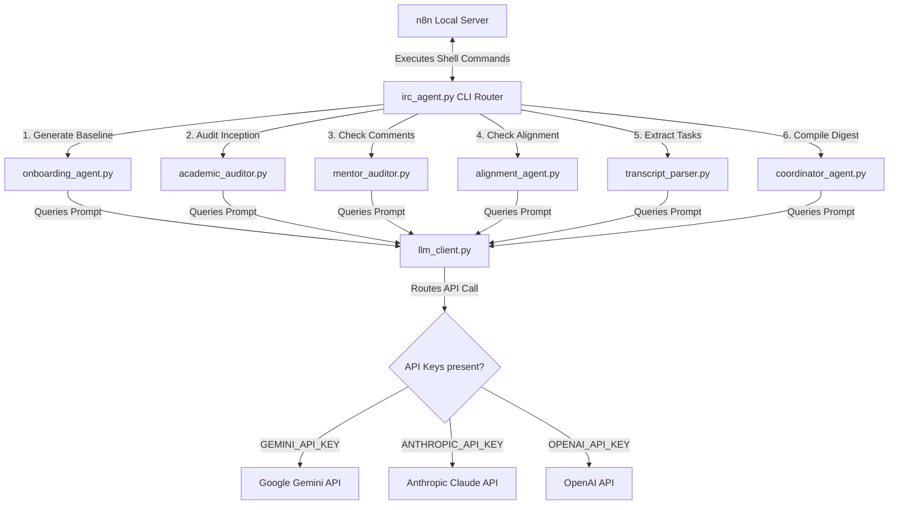

# System & Agent Architecture Overview

This document provides a technical overview of the India Research Corps (IRC) Workflow Automation system.

---

## 1. System Topology

The system uses a hybrid orchestrator-specialist topology:
*   **Orchestration Layer (n8n)**: A local, self-contained n8n server manages schedules, listens for webhook triggers, handles integrations with Google Workspace, Asana, and Airtable, and routes data.
*   **Routing Layer (CLI Router)**: The `irc_agent.py` script serves as the command-line interface (CLI) router, executing actions in a subprocess environment.
*   **Cognitive Layer (Specialist Sub-Agents)**: Specialized Python modules execute discrete, prompt-defined reasoning and analysis tasks.
*   **Model Agnostic Client (LLM Client)**: A centralized, multi-provider wrapper handles API requests to Google Gemini, Anthropic Claude, or OpenAI GPT-4o.

---

## 2. Component Directory

### 2.1 The CLI Router: `irc_agent.py`
Acts as the entry point for all command execution. It copies the active shell's environment variables and injects the current directory into the `PYTHONPATH` to ensure Python resolves package namespaces cleanly in subprocesses. It also wraps all subprocess execution in a global try-except block to return structured JSON envelopes to n8n if an error occurs.

### 2.2 Sub-Agents (`agents/` Package)

#### `onboarding_agent.py` (Expert Baseline Generator)
Constructs a comprehensive, expert-level baseline Inception Report when a student is onboarded. It dynamically adjusts research complexity based on the student's degree level and cohort duration.

#### `academic_auditor.py` (Progress Auditor)
Compares the student's current draft against the expert baseline, takes past coordinator memory guidelines into account, and scores the Core Academic Triad (Methodology, Triangulation, Writing Clarity).

#### `mentor_auditor.py` (Mentor Responsiveness Evaluator)
Evaluates active and resolved comments pulled from the student's Google Doc to assess whether the mentor's feedback is substantive or superficial.

#### `alignment_agent.py` (Sponsor Alignment Analyst)
Measures the alignment between the student's research methodologies and the sponsor's original problem statement, outputting the Sponsor Alignment Index (1-100%).

#### `transcript_parser.py` (Transcript Task Extractor)
Parses plain text meeting summaries (Granola AI transcripts) to identify and extract action items, preventing task boards from becoming cluttered with trivial notes.

#### `coordinator_agent.py` (State Coordinator & Digest Compiler)
Coordinates state operations, extracts coordinator corrections from the `Admin Cheat Sheet` to update persistent memory, and compiles weekly snapshot logs into the Weekly Director Digest.

---

## 3. Centralized LLM Client: `llm_client.py`

To ensure full compatibility across different developer environments and IDEs (Claude Desktop, Cursor, or Codex), the system is completely model-agnostic. 

*   **Key Detection**: Checks for active keys in the environment: `GEMINI_API_KEY`, `ANTHROPIC_API_KEY`, or `OPENAI_API_KEY`.
*   **Model Selection**: Automatically defaults to a robust model (Gemini 2.5 Flash, Claude 3.5 Sonnet, or GPT-4o-mini) or respects user-specified models configured via environment variables (e.g. `ANTHROPIC_MODEL`).
*   **JSON Enforcement**: Features a `json_mode` flag that automatically formats payloads (e.g. `responseMimeType: "application/json"` for Google or `response_format: {type: "json_object"}` for OpenAI) to guarantee output integrity for downstream JSON parsers.
