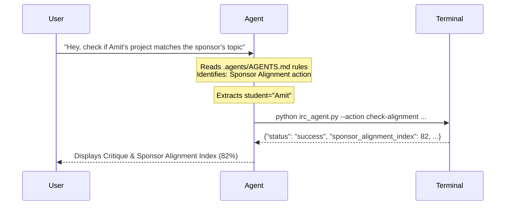

# Trigger Board & Semantic Intent Guide

This document describes how the AI agent's trigger system intercepts natural language prompts from you or your assistants and converts them into automated workspace commands.

---

## 1. How It Works under the Hood

When an AI coding assistant (like Antigravity, Claude Code, Cursor, or Codex) is started in this workspace, it reads the rules defined in **`.agents/AGENTS.md`**.

1.  **Intent Interception**: The agent continuously monitors your input for semantic alignment with the system's core workflows.
2.  **Mapping**: The agent translates the natural language query into the correct Python execution parameters.
3.  **Command Execution**: The agent automatically sets the necessary environment variables (such as `PYTHONPATH`) and runs the CLI router `irc_agent.py` in the background shell.
4.  **Reporting**: The script outputs are parsed and rendered as visual tables, dashboards, or markdown blocks in your chat window.

---

## 2. Natural Phrasing Dictionary

The system does not require rigid syntax. The table below lists the formal triggers and some common natural language variations that your assistants might write:

| System Goal | Formal Trigger | Natural Phrasing Examples (Anything similar will work) |
|---|---|---|
| **Master Cohort Sync** | `run morning checks` | <ul><li>*"Go do whatever is required today"*</li><li>*"Sync the cohort logs"*</li><li>*"Check all student updates"*</li><li>*"Run the morning checks"*</li></ul> |
| **Student Onboarding** | `onboard student [Name]` | <ul><li>*"We have a new student named [Name] joining us"*</li><li>*"Start onboarding for [Name]"*</li><li>*"Set up the workspace for [Name]"*</li></ul> |
| **Progress Audits** | `audit report for [Name]` | <ul><li>*"Grade the draft for [Name]"*</li><li>*"Check the latest report for [Name]"*</li><li>*"Run the academic auditor on [Name]'s file"*</li></ul> |
| **Sponsor Alignment** | `check alignment for [Name]` | <ul><li>*"Does [Name]'s work align with the sponsor?"*</li><li>*"Verify [Name]'s project matches their problem statement"*</li></ul> |
| **Weekly Digest** | `generate weekly digest` | <ul><li>*"Compile the Friday director report"*</li><li>*"Get the weekly summary ready"*</li><li>*"Run the weekly digest"*</li></ul> |

---

## 3. Developer Guidelines for Extending Triggers

If you want to add new verbal triggers in the future:
1.  Open **`.agents/AGENTS.md`**.
2.  Add a new trigger subsection under `## 1. Verbal Prompt Interception`.
3.  Define the `Prompt Patterns` and the exact CLI terminal commands the agent should run.
4.  Update **`docs/TRIGGER_BOARD_GUIDE.md`** to catalog the new commands.
