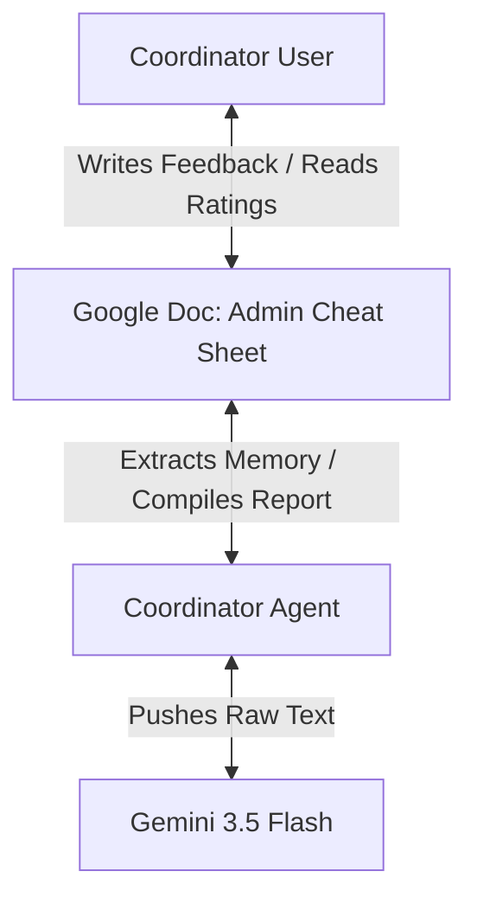

# Agent-Native Architecture Audit: IRC Workflow

**Audit Date**: 2026-07-05  
**Target Codebase**: India Research Corps (IRC) Workflow Automation  
**Core Framework**: Local n8n + Multi-Agent Python router (Gemini 3.5 Flash)

---

## 1. Executive Summary

The IRC Workflow system exhibits a strong **Agent-Native Architecture**. It separates structural orchestration (handled by local n8n triggers and nodes) from qualitative execution and cognitive judgment (delegated to specialized Python sub-agents querying Gemini 3.5 Flash). 

Crucially, the system avoids the "Cardinal Sin" of agentic development by using the agent for semantic analysis and reasoning, rather than hardcoding complex rules in code. It also uses the **Shared Workspace filesystem interface** (the `Admin Cheat Sheet` Google Doc) as the primary interface for user-agent collaboration.

---

## 2. Core Principles Scorecard

### 2.1 Parity (Score: 8/10)
*   **Built Design**: Every major coordinator task (onboarding setup, inception gate verification, document auditing, transcript parsing, and cohort reporting) has a corresponding CLI action in `irc_agent.py` and a dedicated node in the master n8n canvas.
*   **Gap/Future Improvement**: Currently, the agent cannot delete or rename Drive files directly; it only creates and updates them. Adding deletion/archive capabilities would achieve 100% CRUD parity on Drive objects.

### 2.2 Granularity & Primitives (Score: 9/10)
*   **Built Design**: Python scripts are designed as atomic cognitive tools:
    *   `onboarding_agent.py` generates the baseline.
    *   `academic_auditor.py` audits reports and scores competencies.
    *   `alignment_agent.py` measures target sponsor alignment.
    *   `transcript_parser.py` extracts action items.
    *   `coordinator_agent.py` manages memory and weekly digest compilation.
*   **Analysis**: No single agent tries to do everything. Each receives a specific piece of text, does one job, and returns structured data.

### 2.3 Composability & Emergent Capability (Score: 9/10)
*   **Built Design**: Changing or expanding the tracking capabilities is achieved by editing prompts in the sub-agents rather than refactoring structural Python code.
*   **Example**: Adding a new academic rubric or scoring system (e.g. grading field safety) is accomplished simply by modifying the prompt block in `academic_auditor.py`.

### 2.4 Accumulated Context / Memory (Score: 10/10)
*   **Built Design**: The system implements the **`memory.json`** loop. 
*   **Operation**: The Coordinator edits the `Admin Cheat Sheet` document directly, writing correction notes or styling directives. On the next daily run, `coordinator_agent.py` extracts this text and saves it as a persistent memory file. The auditing agent reads this file to adjust its subsequent evaluations, allowing the system to learn and adapt over time without code redeployments.

---

## 3. Tool & Workspace Design Analysis

### 3.1 The Shared Workspace Pattern
A major strength of this architecture is the unified data space:

Both the Coordinator and the AI Agent read and write to the same `Admin Cheat Sheet` Google Doc. The document serves as the boundary interface: the agent posts its findings there, the user reviews and edits them, and the agent pulls the edits back into its persistent context database.

### 3.2 Cardinal Sin Prevention Check
*   **Audit**: Did we write the analysis logic in Python code?
*   **Verdict**: **Pass**. The Python scripts do not contain heuristics or rules-based checks to score methodology, triangulation, or clarity. Instead, the raw texts (baseline + student report + memory) are fed directly to Gemini. The model uses its native understanding of academic research to score the texts and return structured JSON.

---

## 4. Recommendations for Next-Stage Development

1.  **Introduce Explicit Task Completion Signals**:
    *   Currently, n8n executes the CLI agents sequentially and waits for stdout to return. For multi-step agent actions, introduce an explicit task status check (`completed`/`in-progress`/`failed`) so n8n can handle partial execution and resumption.
2.  **Add a `refresh-context` Endpoint**:
    *   As a cohort grows, files inside `memory.json` might accumulate stale coordinator feedback. A utility tool to summarize and compress the history will prevent prompt context bloat.
