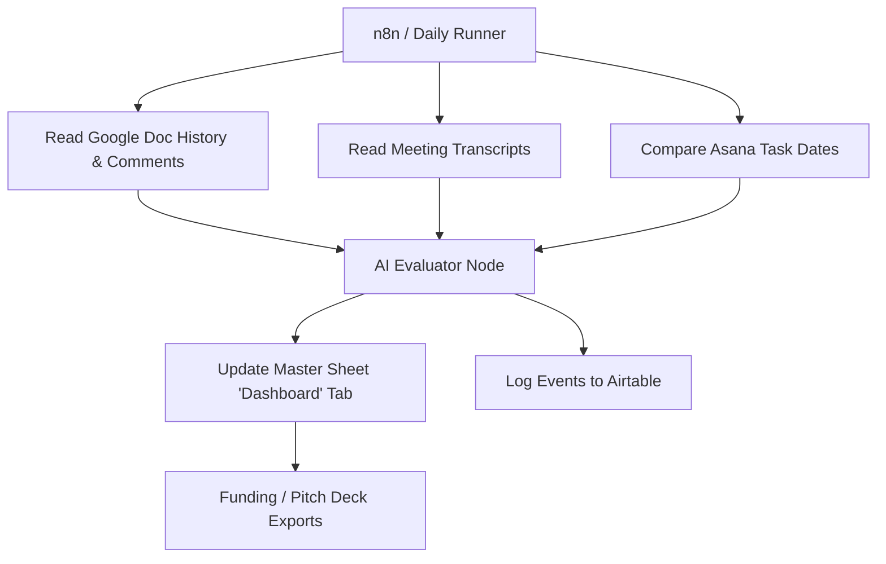

# Requirements: IRC Workflow Scaling & Performance Tracking

This document defines the requirements for scaling the India Research Corps (IRC) workflow system, introducing multi-dimensional tracking metrics to evaluate student progress, mentor quality, cohort success, and operational efficiency.

---

## 1. Objectives & Focus Areas

As the cohort scales, the coordinator needs visibility into what is working and what is causing friction. The tracking system will log detailed metric events to **Airtable** and display aggregated KPIs in a dedicated **Dashboard** tab inside the Master Google Sheet.

The system evaluates four distinct dimensions:
1.  **Student Milestone Slippage & Progress Bottlenecks**
2.  **Mentor Responsiveness & Engagement Quality**
3.  **Cohort-Level Gate Success Rates**
4.  **Operational Task Resolution Rates**

---

## 2. Metric Specifications & Tracking Logic

### 2.1 Student Progress Tracking
To detect if a student is stuck, the system uses two parallel checks:
*   **Gantt/Asana Slippage**: Calculate the delta (in days) between the scheduled milestone/session due date on the student's Gantt Chart and the actual completion date in Asana. Any milestone incomplete 5+ days past the deadline is flagged as "Overdue/Slipped".
*   **AI Document Progress Analysis**: The AI reads the student's `Inception Report` Google Doc revision history. Instead of simple word-count checks, the AI analyzes the *substance* of the changes.
    *   *Green Flag*: Student is adding new methodology sections, defining variables, or integrating literature.
    *   *Red Flag*: No content changes for 7 days, or changes are restricted to minor grammar/formatting edits with no progress on research logic.

### 2.2 Mentor Engagement Audit
The AI performs qualitative and quantitative audits on the mentor's contributions across two mediums:
*   **Google Doc Comment Audit**:
    *   *Turnaround Time*: Delta (in days) between when a student completes a section and when the mentor first reviews it.
    *   *Feedback Quality*: The AI classifies mentor comments into *Substantive* (methodology suggestions, research design critiques, conceptual guidance) vs. *Superficial* (spelling corrections, formatting notes).
    *   *Interaction Score*: Calculate the ratio of substantive feedback.
*   **Meeting Transcript Audit**:
    *   *Attendance*: Log whether the mentor attended the bi-weekly sync.
    *   *AI Sentiment & Alignment*: Evaluate the mentor's tone, helpfulness, and alignment with the student's project scope in the meeting transcript. Verify that they are actively questioning assumptions and guiding the student's field plans.

### 2.3 Cohort & Operational KPI Definitions
The Google Sheets Dashboard and Airtable event logs will compile and display:
*   **Average delay days per session**: Highlights which sessions (e.g., Session 5: Fieldwork Plan) are systemic bottlenecks.
*   **Mentor Engagement Score**: A rolling 1-10 score per mentor based on comments and transcript quality.
*   **Operational Task Completion Rate**: Tracking the speed at which action items extracted from transcripts (for students, mentors, and coordinators) are marked complete in Asana.
*   **Inception Gate Success Rate**: Percentage of students successfully passing the 1-month presentation gate.

### 2.4 Funding & Impact Metrics (For Pitching & Scaling)
To prove research quality and process efficiency to future funding partners, the system tracks and compiles:
*   **Student Competency Growth Index**:
    *   *Mechanism*: For every audit, the AI Academic Auditor scores the report on the **Core Academic Triad** (Scientific Methodology, Data Triangulation, and Academic Writing Clarity) on a scale of 1-10.
    *   *KPI*: Logs the trajectory and calculates the delta/growth slope from Month 1 to Final Thesis.
*   **Sponsor Alignment Index**:
    *   *Mechanism*: A dual-check AI audit comparing the student's research against the sponsor's original problem statement.
    *   *Milestones*: Executed at the **Month 1 Inception Gate** (to correct drift early) and at **Final Thesis Submission** (to prove alignment/impact).
*   **Cohort Success Velocity**:
    *   *Mechanism*: Tracks total delay days categorized by cohort phase (Induction, Fieldwork, Thesis).
    *   *KPI*: Compares current cohort phase averages against historical cohort baselines to display process maturity.

---

## 3. Technology & Integration Design

### 3.1 Google Sheets Dashboard Tab
*   Contains summary tables for average cohort slippage.
*   Shows charts displaying mentor engagement scores and task resolution rates.
*   **Funding Metrics Panel**: Visualizes student competency growth slopes (triad), sponsor alignment scores, and cohort-to-cohort phase delay comparisons.
*   Flags high-risk students and unresponsive mentors in red.

### 3.2 Airtable Logging Schema
*   **Students Table**: Student details, cohort, calculated timeline offsets, and final Sponsor Alignment Index.
*   **Competency Logs Table**: [NEW] Time-stamped scores for the Core Academic Triad (Methodology, Triangulation, Clarity) for calculating student growth curves.
*   **Task Logs Table**: Every Asana task created, assigned, due date, actual completion date, and delay days.
*   **Mentor Audits Table**: Logs each comment review event, feedback classification, transcript tone analysis, and calculated weekly engagement score.
*   **Metrics Table**: Daily snapshot of cohort-level KPIs (average slippage, task completion rate, phase bottlenecks, historical comparisons).

---

## 4. Outstanding Decisions / Next Steps

*   **Airtable Credentials**: You will need to provide an Airtable Base ID and API token to connect n8n.
*   **Historical Baselines**: For the Cohort Success Velocity chart, you will need to enter the average delays from your previous cohort cycles into the Airtable `Metrics` table.
*   **OpenAI/Gemini Token Usage**: The AI analysis of Google Doc history and transcripts will run daily. We will build prompts that extract compact summaries to minimize API costs.

